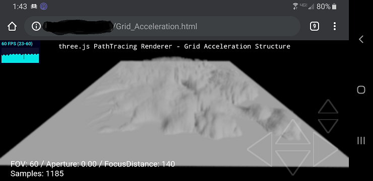

# THREE.js-PathTracing-Renderer
Real-time PathTracing with global illumination and progressive rendering, all on top of the Three.js WebGL framework.

<h2>LIVE DEMOS</h2>

* [Geometry Showcase Demo](https://erichlof.github.io/THREE.js-PathTracing-Renderer/Geometry_Showcase.html) demonstrating some primitive shapes for ray tracing.  

* [Ocean and Sky Demo](https://erichlof.github.io/THREE.js-PathTracing-Renderer/Ocean_And_Sky_Rendering.html) mixes ray tracing with ray marching and models an enormous calm ocean underneath a realistic physical sky. Now has more photo-realistic procedural clouds!

* [Billiard Table Demo](https://erichlof.github.io/THREE.js-PathTracing-Renderer/Billiard_Table.html) shows support for loading image textures (i.e. .jpg .png) to be used for materials. The billiard table cloth and two types of wood textures are demonstrated.

* [Cornell Box Demo](https://erichlof.github.io/THREE.js-PathTracing-Renderer/Cornell_Box.html) This demo renders the famous old Cornell Box, but at 60 FPS - even on mobile!

For comparison, here is a real photograph of the original Cornell Box vs. a rendering with the three.js PathTracer:

 

 

* [Volumetric Rendering Demo](https://erichlof.github.io/THREE.js-PathTracing-Renderer/Volumetric_Rendering.html) renders objects inside a volume of dust/fog/etc..  Notice the cool volumetric caustics from the glass sphere on the left, rendered almost instantly!

* [Terrain Demo](https://erichlof.github.io/THREE.js-PathTracing-Renderer/Terrain_Rendering.html) combines traditional raytracing with raymarching to render stunning outdoor environments in real time!  Land is procedurally generated, can be altered with simple parameters. Total number of triangles processed for these worlds: 2! (for screen size quad) :-)

* [Arctic Circle Demo](https://erichlof.github.io/THREE.js-PathTracing-Renderer/Arctic_Circle.html) I was experimenting with my ray marching engine and what types of environments I could get out of it by just altering some parameters.  When the scene first opens, it's almost like you're transported to the far north! The time of year for this demo is summer - notice how the sun never quite sets below the horizon.

* [Planet Demo (W.I.P.)](https://erichlof.github.io/THREE.js-PathTracing-Renderer/Planet_Rendering.html) takes raymarching and raytracing to the extreme and renders an entire Earth-like planet with physically-based atmosphere!  Still a work in progress, the terrain is procedurely generated.  Although the mountains/lakes are too repetitious (W.I.P.), this simulation demonstrates the power of path tracing: you can hover above the planet at high orbit (5000 Km altitude), then drop all the way down and land your camera right on top of a single rock or single lake water wave (1 meter). All planet/atmosphere measurements are to scale.  The level of detail possible with raytracing is extraordinary! *Note: demo is for desktop only - mobile lacks the precision to explore the terrain correctly and has rendering artifacts. Mobile is a W.I.P.*

* [Quadric Geometry Demo](https://erichlof.github.io/THREE.js-PathTracing-Renderer/Quadric_Geometry_Showcase.html) showing different quadric (mathematical) ray tracing shapes.

* [Water Rendering Demo](https://erichlof.github.io/THREE.js-PathTracing-Renderer/Water_Rendering.html) Renders photo-realistic water and simulates waves at 60 FPS. No triangle meshes are needed, as opposed to other traditional engines/renderers. The water surface is achieved through ray marching.

<h3>BVH Acceleration Structure Demos (Desktop only)</h3>

*Note: the following BVH demos are for Desktop only.  Mobile is still a Work in Progress*

* [BVH Point Light Source Demo](https://erichlof.github.io/THREE.js-PathTracing-Renderer/BVH_Point_Light_Source.html) Demonstrates the use of a point light to illuminate the famous Stanford Bunny (30,000+ triangles!).  Normally a dark scene like this with a very bright small light would be very noisy, but thanks to randomized direct light targeting, the image converges almost instantly!

* [BVH Spot Light Source Demo](https://erichlof.github.io/THREE.js-PathTracing-Renderer/BVH_Spot_Light_Source.html) A similar scene but this time a bright spotlight in the air is aimed at the Stanford Bunny, making him the star of the scene!  The spotlight is made out of dark metal on the outside and a reflective metal on the inside.  Notice the light falloff on the checkered floor.

* [Animated BVH Model Demo](https://erichlof.github.io/THREE.js-PathTracing-Renderer/BVH_Animated_Model.html) not only loads and renders a 15,000+ triangle GLTF model with correct PBR materials (albedo, emmisive, metallicRoughness, and normal maps), but it also translates and rotates the entire model and its BVH structure in real time at 60 fps!  Loading and ray tracing bone animations for rigged models is still under investigation, but getting rigid models to move, rotate, and scale arbitrarily was a huge step forward for the pathtracing game engine!

* [HDRI Environment Demo](https://erichlof.github.io/THREE.js-PathTracing-Renderer/HDRI_Environment.html) shows how to load an equi-rectangular HDRI map to use as the scene's surrounding environment.  This demo also uses the optimized BVH accelerator to load the famous Stanford Dragon model consisting of 100,000 triangles and renders the scene in real-time!  I also added a material and color picker so you can instantly change the dragon's material type (glass, metal, ceramic) as well as its material color without missing a beat! *Note: please allow 5-10 seconds to download the large HDR image*

* [BVH Visualizer Demo](https://erichlof.github.io/THREE.js-PathTracing-Renderer/BVH_Visualizer.html) Lets you peek under the hood of the BVH acceleration structure and see how the various axis-aligned bounding boxes are built all the way from the large surrounding root node box (level 0), to the small leaf node boxes (level 14+), to the individual triangles of the model that are contained within those leaf node boxes.  This demo loads the famous Stanford Dragon (100,000 triangles!) and renders it as a purple light source inside yellow glass bounding boxes of its BVH. 

* [GLTF Viewer Demo](https://erichlof.github.io/THREE.js-PathTracing-Renderer/Gltf_Viewer.html) This cool viewer not only loads models in glTF format, but also uses three.js' RGBE.Loader to load an equi-rectangular HDR image as the background and for global lighting. Many thanks to github user [n2k3](https://github.com/n2k3) for his awesome contributions to this viewer!  He implemented a slick loading animation as well as a GUI panel that allows you to change the sun angle, sun intensity, sun color, hdr intensity, and hdr exposure.  

<h3>Constructive Solid Geometry(CSG) Museum Demos</h3>

The following demos showcase different techniques in Constructive Solid Geometry - taking one 3D shape and either adding, removing, or overlapping a second shape. *Note: these demos may take several seconds to compile*  
All 4 demos feature a large dark glass sculpture in the center of the room, which shows Ellipsoid vs. Sphere CSG.  
Along the back wall, a study in Box vs. Sphere CSG: [CSG_Museum Demo #1](https://erichlof.github.io/THREE.js-PathTracing-Renderer/CSG_Museum_1.html)  
Along the right wall, a glass-encased monolith, and a study in Sphere vs. Cylinder CSG: [CSG_Museum Demo #2](https://erichlof.github.io/THREE.js-PathTracing-Renderer/CSG_Museum_2.html)  
Along the wall behind the camera, a study in Ellipsoid vs. Sphere CSG: [CSG_Museum Demo #3](https://erichlof.github.io/THREE.js-PathTracing-Renderer/CSG_Museum_3.html)  
Along the left wall, a study in Box vs. Cone CSG: [CSG_Museum Demo #4](https://erichlof.github.io/THREE.js-PathTracing-Renderer/CSG_Museum_4.html)  

Important note! - There is a hidden Easter Egg in one of these 4 Museum demo rooms.  Happy hunting!

<h3>Materials Demos</h3>

* [Switching Materials Demo](https://erichlof.github.io/THREE.js-PathTracing-Renderer/Switching_Materials.html)
This demo showcases different surface material possibilities. The materials that are feautured are: Diffuse (matte wall paint/chalk), Refractive (glass/water), Specular (aluminum/gold), ClearCoat (billiard ball, plastic, porcelain), Car clearCoat (painted metal with clear coat), Translucent (skin/balloons, etc.), and shiny SubSurface scattering (polished Jade/wax/marble, etc.)  

* [Material Roughness Demo](https://erichlof.github.io/THREE.js-PathTracing-Renderer/Material_Roughness.html)
Demonstrates increasing levels of roughness on different materials.  From left to right, roughness on the left sphere is set at 0.0, then 0.1, 0.2, 0.3 etc., all the way to the max: 1.0 roughness on the right sphere. The demo starts out with a clearcoat cyan plastic-like material, but you can choose different material presets from the selection menu, as well as change the material color in realtime.  I have researched and improved the importance sampling of specular lobes for various amounts of roughness, which results in very fast convergence, especially with smoother to medium-rough materials.  Try all the presets for yourself!  
 

<h3> Real-Time Transformation of Primitive Geometry</h3>

* [Transforming Quadric Geometry Demo](https://erichlof.github.io/THREE.js-PathTracing-Renderer/Transforming_Quadric_Geometry_Showcase.html) Using the game engine version of the three.js path tracer, this demo shows how to create multiple objects (a bunch of 'THREE.Object3d()'s, each with its own transform) on the JavaScript side when initializing three.js, and then send the objects over to the GPU for realtime pathtracing.  The nice thing about having my pathtracer sitting on top of three.js is that I can use its built-in transformations such as Translate, Rotate, and Scale.  Since these shapes are mathematical (all quadrics), I also included clipping parameters so you can have partial shapes and can even animate the cutting process! *Note: this demo may take several seconds to compile*    

* <h3>Classic Scenes</h3>

While working at Bell Labs and writing his now-famous paper [An Improved Illumination Model for Shaded Display](http://artis.imag.fr/Members/David.Roger/whitted.pdf), J. Turner Whitted created an iconic ray traced scene which showcased his novel methods for producing more realistic images with a computer. Beginning work in 1978, he rendered a handful of scenes featuring spheres and planes with various materials and reflectivity, so that these images would be included in his paper (which would be published in June 1980).  Then for an upcoming SIGGRAPH conference submission, Whitted decided to create an animated sequence of individual rendered images.  Thus the first ever ray traced animation was born!  This style of putting together single frames of pre-rendered images would continue through a great lineage of movies such as Tron, Toy Story, Cars, all the way to current animated feature films.     

[Vintage 1979 Video: 'The Compleat Angler' by J. Turner Whitted](https://youtu.be/0KrCh5qD9Ho)

Although this movie appears as a smooth animation, it took around 45 minutes to render each individual frame back in 1979!  Fast forward to today and using WebGL 2.0 and the parallel processing power of GPUs, here is the same iconic scene rendered at 60 times a second in your browser! :  
* [The Compleat Angler demo](https://erichlof.github.io/THREE.js-PathTracing-Renderer/Classic_Scene_Whitted_TheCompleatAngler.html)  

Thank you Dr. Whitted for your pioneering computer graphics work and for helping to start the rendered animation industry!    
 

In 1986 James T. Kajiya published his famous paper [The Rendering Equation](http://citeseerx.ist.psu.edu/viewdoc/summary?doi=10.1.1.63.1402), in which he presented an elegant and profound unifying integral equation for rendering.  Since the equation is infinitely recursive and hopelessly multidimensional, he suggests using Monte Carlo integration (sampling and averaging) in order to converge on a solution.  Thus Monte Carlo path tracing was born, which this repo follows very closely.  At the end of his paper he included a sample rendered image that demonstrates global illumination through Monte Carlo path tracing:

And here is the same scene from 1986, rendered in real-time at 60 fps:  
* [The Rendering Equation Demo](https://erichlof.github.io/THREE.js-PathTracing-Renderer/Classic_Scene_Kajiya_TheRenderingEquation.html)  
 

* <h4>Bi-Directional Path Tracing</h4> In December of 1997, Eric Veach wrote a seminal PhD thesis paper on methods for light transport http://graphics.stanford.edu/papers/veach_thesis/  In Chapter 10, entitled Bi-Directional Path Tracing, Veach outlines a novel way to deal with difficult path tracing scenarios with hidden light sources (i.e. cove lighting, recessed lighting, spotlights, etc.).  Instead of just shooting rays from the camera like we normally do, we also shoot rays from the light sources, and then later join the camera paths to the light paths.  Although his full method is difficult to implement on GPUs because of memory storage requirements, I took the basic idea and applied it to real-time path tracing of his classic test scene with hidden light sources.  For reference, here is a rendering made by Veach for his 1997 paper:

And here is the same room rendered in real-time by the three.js path tracer:  
* [Bi-Directional PathTracing Demo](https://erichlof.github.io/THREE.js-PathTracing-Renderer/Bi-Directional_PathTracing.html)  

The following classic scene rendering comes from later in the same paper by Veach.  This scene is intentionally difficult to converge because there is no direct light, only indirect light hitting the walls and ceiling from a crack in the doorway.  Further complicating things is the fact that caustics must be captured by the glass teapot on the coffee table, without being able to directly connect with the light source.

And here is that scene rendered in real-time by the three.js path tracer: Try pressing 'E' and 'R' to open and close the door!  
* [Difficult Lighting Classic Test Scene Demo](https://erichlof.github.io/THREE.js-PathTracing-Renderer/Bi-Directional_Difficult_Lighting.html) *Note: because it uses a BVH, this demo is recommended for Desktop. Mobile is a W.I.P.*  

I only had the above images to go on - there are no scene dimensions specifications that I am aware of.  However, I feel that I have captured the essence and purpose of his test scene rooms.  I think Veach would be interested to know that his scenes, which probably took several minutes if not hours to render back in the 1990's, are now rendering real-time (30-60 fps) in a web browser! :-D

For more intuition and a direct comparison between regular path tracing and bi-directional path tracing, here is the old Cornell Box scene again but this time there is a blocker panel that blocks almost all of the light source in the ceiling.  The naive approach is just to path trace normally and hope that the camera rays will be lucky enough to find the light source:
* [Naive Approach to Blocked Light Source](https://erichlof.github.io/THREE.js-PathTracing-Renderer/Compare_Uni-Directional_Approach.html) As we can painfully see, we will have to wait a long time to get a decent image!
Enter Bi-Directional path tracing to the rescue!:
* [Bi-Directional Approach to Blocked Light Source](https://erichlof.github.io/THREE.js-PathTracing-Renderer/Compare_Bi-Directional_Approach.html) Like magic, the difficult scene comes into focus - in real-time!      

<h3>Game Engine path tracer for Desktop and Mobile</h3>

Before I got into this world of path tracing, I was a 3D game programmer (and still am, although path tracing is consuming most of my coding time!).  My first game was way back in 1998, using OpenGL 1 and the C language, back when these new things called graphics cards were all the rage! [my old Binary Brotherz page](https://web.archive.org/web/20010405004141/http://www.binarybrotherz.com/games.html)  Although using OpenGL back then and WebGL today was/is cool, I always wanted more in terms of lighting, shadows, reflections, diffuse color sharing, etc., in my game engines that I just couldn't get from rasterizing graphics APIs.  Well, fast forward to 2019 and NVidia is releasing graphics cards dedicated to real-time ray tracing!  I couldn't have imagined this back in the 90's! However, at the time I'm writing this, NVidia is only doing specular ray tracing as a bonus feature on top of the old rasterization technique. I wanted to see if I could 'overclock' my full path tracer's convergence so that you could see the beautiful light effects in real time, being able to possibly move a game character or 1st-person camera through a path-traced dynamic game environment at 60 fps and 30-60 fps on mobile.  If you're willing to sacrafice some ultimate physical reality (like perfect converged reflected/refracted caustics), then you can have this!:  

* [Future Game Engine PathTracer Demo](https://erichlof.github.io/THREE.js-PathTracing-Renderer/GameEngine_PathTracer.html) 
To my knowledge, this is just about as fast as I can push the path tracing engine and WebGL in general, and still retain good lighting, accurate reflections, and almost instant image convergence.  As computers get faster, this will be the heart of future game rendering engines - a simple path tracer that is just around 500 to 1000 lines of code, is easy to maintain and debug, and which gives photo-realistic real-time results! I already have some ideas for some simple 3d games that can use this technology.  I'll keep you posted!  
 

<h2>PATH TRACED GAMES</h2>

*Update: 1/21/2021*
- In 1986 when I was 13 years old and on my Commodore 64 (I know, I'm old), Geoff Crammond released his masterpiece, The Sentinel.  This iconic game featured true 3D filled polygons (an amazing feat running on underpowered 80's hardware!) and had a haunting look and atmosphere like no other before it (or after).  This was the first game that I played that truly immersed me, surrounding the player from all angles with its sterile, other-worldly environment.  I've always wanted to pay homage to my favorite game of all time, while maybe adding some of my personal path tracing touch to it.  So it is with much joy that I present, The Sentinel: 2nd Look.  This fully path traced remake contains a random landscape generator (which I had to figure out from looking at the classic over several months), an added day cycle, pixel-perfect raytraced shadows on the terrain and game objects, object self-shadowing, and true raytraced reflections on the white/black connector panels of the landscape.   
 
    Creating this remake forced me to figure out how to make a dynamic top-level BVH over many moving, rotating game objects/models, each with their own unique BVHs for their own triangle geometry.  I'm happy to report that not only does my new system work, it can completely rebuild and update the whole top-level BVH in a split second, allowing for more complex, path traced dynamic game environments!  As of now, this project is a W.I.P. (gameplay and game logic to be added soon), but I just wanted to share this passion project of mine, as well as the technical major step forward (in BVH technology) that will allow a wider range of real time games and applications to be path traced right inside your browser!
  

* [The Sentinel: 2nd Look (W.I.P.) game](https://erichlof.github.io/TheSentinel-2nd-Look/TheSentinel_2nd_Look.html) on Desktop, click to capture Mouse
* [The Sentinel: 2nd Look project](https://github.com/erichlof/TheSentinel-2nd-Look)  

*Update: 12/18/2020*
- Continuing my series of path traced games for desktop and mobile, I happily present: Path Traced Pong!  The iconic game of Pong holds a special place in my heart as it was my first computer game experience as a 6 year old in 1979, played on my brand new Atari 2600!  My version of Pong brings the classic into 3D, and is played inside the CG-famous 'Cornell Box'.  Path Traced Pong features real time raytraced reflections, soft shadows, transparency, dynamic light sources, and path traced global illumination.  As with AntiGravity Pool, I made a dedicated repository for just this new game. I must say, once you start playing, it's hard to stop!  I didn't realize how addictive it would become!  

* [Path Traced Pong game](https://erichlof.github.io/PathTracedPong/Path_Traced_Pong.html) on Desktop, click to capture Mouse
* [Path Traced Pong project](https://github.com/erichlof/PathTracedPong)  

*Update: 5/24/2019*
- I am pleased to announce the first ever path traced game for desktop and mobile: AntiGravity Pool!  If you've ever played American 8-ball before, then you already know how to play - except that gravity has been shut off! LOL. I tried to imagaine how our distant future descendants would enjoy the game of billiards while in the HoloDeck.  Warping the 2D classic pool table into a 3D cube presents some unique and interesting challenges for the player.  AntiGravity Pool features real-time raytraced reflections, soft shadows, and path traced global illumination from 8 light sources (which is challenging for path tracers).  Since it uses a physics engine and various custom components, I decided to create a dedicated repository for just this new game. Be sure to check it out! 

* [AntiGravity Pool game](https://erichlof.github.io/AntiGravity-Pool/AntiGravityPool.html) on Desktop, press SPACEBAR to shoot! :)
* [AntiGravity Pool project](https://github.com/erichlof/AntiGravity-Pool)   

 
 
A random sample rendering from the three.js pathtracing renderer as it was back in 2015!
 

<h2>FEATURES</h2>

* Real-time interactive Path Tracing in your browser - even on your smartphone! ( What?! )
* First-Person camera navigation through the 3D scene.
* When camera is still, switches to progressive rendering mode and converges on a highest quality photo-realistic result!
* The accumulated render image will converge at around 500-3,000 samples (lower for simple scenes, higher for complex scenes).
* My custom randomized Direct Light targeting now makes images render/converge almost instantly!
* Both Uni-Directional (normal) and Bi-Directional path tracing approaches available for different lighting situations.
* Support for: Spheres, Planes, Discs, Quads, Triangles, and quadrics such as Cylinders, Cones, Ellipsoids, Paraboloids, Hyperboloids, Capsules, and Rings/Torii. Parametric/procedural surfaces (i.e. terrain, clouds, waves, etc.) are handled through Raymarching.
* Constructive Solid Geometry(CSG) allows you to combine 2 shapes using operations like addition, subtraction, and overlap.
* Support for loading models in .gltf and .glb formats
* BVH (Bounding Volume Hierarchy) greatly speeds up rendering of triangle models in gltf/glb format (tested up to 800,000 triangles!)
* Current material options: Metallic (mirrors, gold, etc.), Transparent (glass, water, etc.), Diffuse(matte, chalk, etc), ClearCoat(cars, plastic, polished wood, billiard balls, etc.), Translucent (skin, leaves, cloth, etc.), Subsurface w/ shiny coat (jelly beans, cherries, teeth, polished Jade, etc.)
* Solid transparent objects (i.e. glass tables, glass sculptures, tanks filled with water or other fluid, etc) now obey the Beer-Lambert law for ray color/energy attenuation.
* Support for PBR materials on models in gltf format (albedo diffuse, emissive, metallicRoughness, and normal maps)        
* Diffuse/Matte objects use Monte Carlo integration (a random process, hence the visual noise) to sample the unit-hemisphere oriented around the normal of the ray-object hitpoint and collects any light that is being received.  This is the key-difference between path tracing and simple old-fashioned ray tracing.  This is what produces realistic global illumination effects such as color bleeding/sharing between diffuse objects and refractive caustics from specular/glass/water objects.
* Camera has Depth of Field with real-time adjustable Focal Distance and Aperture Size settings for a still-photography or cinematic look.
* SuperSampling gives beautiful, clean Anti-Aliasing (no jagged edges!)

<h3>Experimental Works in Progress (W.I.P.)</h3>

The following demos show what I have been experimenting with most recently.  They might not work 100% and might have small visual artifacts that I am trying to fix.  I just wanted to share some more possible areas in the world of path tracing! :-)  

Some pretty interesting shapes can be obtained by deforming objects and/or warping the ray space (position and direction) around these objects.  This demo applies a twist warp to the spheres and mirror box and randomizes the positional space of the top purple sphere, creating an acceptable representation of a little cloud.  

* [Ray/Object Warping Demo](https://erichlof.github.io/THREE.js-PathTracing-Renderer/Ray_Warping.html) 

When rendering/raytracing Terrain, you can either raymarch a Perlin noise texture (as I have demonstrated in the above Terrain_Rendering and Planet_Rendering demos), or you can just load in a large pre-existing triangle terrain mesh and raytrace it in the traditional way.  Both have their advantages and disadvantages. However, if you want to go the classical raytracing route, to make the land contours a little more convincing, there needs to be a *lot* of triangles!  The following WIP preview demo uses the BVH acceleration structure to load in and quickly render a huge terrain mesh consisting of no less than 734,464 triangles!  It really pushes my BVH code to the max - we're pretty near a million triangles here, pathtracing in WebGL!  For now I just stuck a checker texture across the terrain and the environment is simply a large skylight dome.  But the good news is that it doesn't crash the browser, and it runs slightly above 30 fps even on my humble laptop - it's amazing that all of this is happening inside a browser webpage!  Warning: because of the large BVH data set that needs to be built at startup, this demo is Desktop only and will take at least 10-15 seconds to compile - please be patient, it's worth the wait! ;-)  

* [BVH Large Terrain Demo (W.I.P.)](https://erichlof.github.io/THREE.js-PathTracing-Renderer/BVH_Terrain.html) *Note: because it uses a BVH, this demo is for Desktop only - Warning: due to the large data set, it will take 10-15 seconds or more to load and compile* 

Finally I found a way to render dense polygonal(triangle) models on Mobile devices without them crashing!  Inspired by an older Shadertoy demo by user koiava that I came across - https://www.shadertoy.com/view/MtBSzd - I noticed that my mobile device didn't crash when trying that particular demo with 1000 triangles.  I copied / edited / optimized the traversal code and lo and behold, it not only compiles on Mobile without crashing, it ran at 50-60 fps on my smartphone!  Then, I did the unthinkable (for me anyway) - I sent down over 2 million triangles to the engine to be raytraced, then raytraced yet again for the reflection/shadow ray pass (so effectively 4,200,000 triangles in a single frame, and .... my Samsung 9 still runs at nearly 60 fps!  It didn't even blink an eye.  Compilation takes maybe 1 second.  I couldn't believe what I was seeing at first. 
 

* [Grid Acceleration Demo (W.I.P.)](https://erichlof.github.io/THREE.js-PathTracing-Renderer/Grid_Acceleration.html) *Note: because it uses a Uniform Grid rather than a BVH, this demo is for Desktop AND Mobile!  Whoo-hoo!* 

A technical note about what you are seeing: The data arrives to the fragment shader through a 1024x1024 heightmap texture (I randomly chose a DinoIsland.png heightmap, but it can be anything, even a realtime video texture).  The acceleration structure handles sampling the texture and stepping the ray through each sample cell.  The number of cells is up to you.  At first I tried 32x32 cells, and each cell is a square, and each of the 4 corners of that square is a vertex that is used by 2 triangles sandwiched together back-to-back.  So to get the number of triangles that you must raytrace, you take 32 cells width times 32 cells height and remember that each square cell contains 2 triangles, so multiply all that times 2, so 32Wx32Hx2t  which is 2048 triangles representing the polygon heightmap.  Now 2048 triangles sounds like a lot, and it is for raytracing, but the result mesh looks like an old-school low-poly terrain - it is not detailed enough.  On a whim, I tried a resolution of 1024, so each little texel of the 1024x1024 source texture image has its own quad cell, and 2 triangles for every one of those quad cells.  So now we have 1024x1024x2, or 2,097,152 triangles every frame!  And since the grid looks up the texture to get the triangle vertices every frame, you can animate the height/depth of the displacement as well as even play an HD video (saved as textures) with an embossed-effect on the terrain in real time!    
     Oddly, it turns out that my Mobile device (a Samsung S9) trounces my laptop at this demo.  The humble old laptop achieves maybe 20fps, whereas the newer smartphone rocks at 40-60fps.  I'm not sure why this is the case, because my laptop can run the BVH demos at 60fps whereas my smartphone can't even compile the BVH demos.  It may have to do with the cheap integrated graphics of my laptop, but in any case, this is a true testament to the power of modern smartphone GPUs!  Once I found the right kind of data structure for it, my mobile device can raytrace millions of triangles in real-time!   

<h2>Updates</h2>

* December 18th, 2020: The 'Games' section above has a new game: Path Traced Pong!  Continuing the series of real-time path traced games for any device with a browser (including mobile!), Path Traced Pong brings the iconic game of Pong into 3D, played inside the CG-famous Cornell Box.  Throughout my journey into 3D graphics, starting with C and OpenGL 1.0 under Windows 98, I have made now 3 versions of this game.  The first version was back in 1999, the second version was with a young three.js around late 2013, and now in 2020, Path Traced Pong uses the latest version of three.js and features real-time path traced global illumination with raytraced reflections, soft shadows, and dynamic light sources.  It is fun to play on desktop, but even more fun is when you're on the go, you can play it on your phone!  Each demo in this repo, and more currently, each new game that I try to program, presents me with new and interesting challenges, especially when trying to path trace a fast-paced game on any commodity hardware.  I learned a little more about successfully rendering dynamic, quick-moving game objects, as well as more efficiently sampling dynamic light sources (such as the bright white game ball as it bounces against the room walls).  My first 2 older versions featured basic network multiplayer over Sockets - in the future it would be nice to add WebSockets capability to these path traced games.  This would bring exciting new possibilities as players would not only be able to play a quick game online together, they would experience real time path traced game worlds!  I have more ideas for other simple, yet fun, 3D games that would benefit from this technology.  As always, I'll keep you posted! :)  

* November 18th, 2020: New method of random number generation (rng) across all demos.  Previously I had used the brilliant Inigo Quilez's (iq on ShaderToy) integer bit-manipulation GPU rng as it was fast and produced random-looking white noise (no clumps or patterns), which is a must for any Monte Carlo path tracer.  Then in the back of my mind was Edd Biddulph's path traced version of Quake II https://amietia.com/q2pt.html - which Christoph Schied used as a starting point to build his improved Q2VKPT http://brechpunkt.de/q2vkpt/ - and finally the RTX team at NVIDIA used that to create the now-popular Quake II RTX https://www.nvidia.com/en-us/geforce/news/quake-ii-rtx-ray-traced-remaster-out-now-for-free/ .  What all these real-time path traced versions had in common was their use of Blue noise textures to produce random numbers and to randomly sample the lighting in the scene.  Their argument was that when dealing with noise (which all path tracers must contend with), Blue noise produces cleaner, smoother, slightly less-distracting noise than traditional White noise.  I used their idea as starting inspiration to improve the smoothness of my own renderer.  Instead of cycling through 64 smaller 64x64 Blue noise textures on the GPU as they do, I load a single, bigger 256x256 pre-generated Blue noise RGBA texture.  Then each animation frame, I generate 2 random numbers on the Javascript CPU side, pass them in to the GPU as uniforms, and then use them as texture UV offsets to add uniformly to each pixel when sampling the Blue noise texture.  I then cycle through the 4 channels, (R,G,B, and A) for that pixel and accumulate and use the fractional portion (0.0000.. to 0.9999..) of the result value to generate 'random' numbers.  These numbers in turn drive the random ray directions for light gathering on diffuse surfaces and rough specular surfaces as well as pixel offsets for sub-pixel AA and Depth-of-field effects.  Since they are used everywhere and many times in one GPU animation frame, whichever rng you choose has to be reliable and fast.  Well I'm happy to report that switching to Blue noise texture lookups for the rng not only improved the visual quality on dynamic scenes, on static progressively rendered scenes the image converges even faster, and last but not least, mobile even got a framerate boost on some scenes!  I sort of expected and hoped for the visual quality improvement, but surprising to me was the boost in convergence speed across all static demos and even more surprising was the boost in mobile framerate.  I can explain the visual quality and convergence speed boosts, as Blue noise is more smoothly and evenly distributed over its domain. Ray directions are more likely to cover a better portion of the sampling hemisphere above them when using Blue noise rather than more chaotic White noise.  However I can only guess at the explanation for the mobile frame rate boost - I think it may have to do with GPU thread convergence/divergence.  At any rate, I'm happy that I got all of this working because it is the first step in eventually implementing a realtime de-noiser for dynamic scenes.  I'm still learning about de-noisers like the ones used in Q2VKPT, Quake II RTX and Minecraft RTX and although I may never achieve something as sophisticated and cutting-edge as theirs, I might be able to at least have some denoising in place, which will ultimately benefit the entire renderer.   

* September 18th, 2020: Big changes in all the pathtracing shaders across the whole repo.  About a year ago I had switched transparent/clearCoat materials (water, glass, plastic, ceramic, etc.) from being rendered with a random Monte Carlo approach to a split ray branch brute-force approach.  To clarify, when your viewing ray hits a transparent surface like a glass window for example, some of the light's energy bounces off the surface (reflecting), while the remainder of the energy penetrates the surface - the rays transmit on through (also called refracting).  The percentage of rays that reflect vs. the percentage that transmit is calculated by the well-known Fresnel equations, which depend on your viewing angle to the surface as well as the index of refraction of the material (related to how dense it is).  When rendering these transparent materials, you have a choice - you can either reflect or refract randomly with Monte Carlo integration, or you can go down the reflection path branch first, render what's there, then start back at the same transparent surface and follow the transmission (refraction) path branch, and render what's there.  The reason I had switched from Monte Carlo style to brute-force both-branches style a year ago is because I thought my transparent surfaces didn't look quite right and were too noisy.  Until recently, I subscribed to the brute-force both-paths way with all my shaders, but unfortunately I noticed a frame rate penalty associated with this computationally intensive technique, especially on mobile.  The other day I was re-reading Peter Shirley's old out-of-print classic book, "Realistic Ray Tracing, 2nd Edition", and he advocated using the first Monte Carlo way like I used to have in place years ago.  In the book he mentions that if you use Monte Carlo integration for anything, you have to correctly apply the probabilistic weights, otherwise things will be either too dark, too bright, or too noisy due to undersampling or oversampling.  Turns out I had neglected to put those probabilistic weights in my old Monte Carlo randomized branch picker code for transparent surfaces.  When I added these correct weights in and went back to try the Monte Carlo style again, everything looked perfect!  And the associated noise due to randomness inherent in Monte Carlo styles was much smoother and more tolerable, thanks to the correct probabilistic weights.  Now all surfaces - Diffuse, rough Metals, Glass, Water, ClearCoat, etc. all use the same type of Monte Carlo random branch selector code with the (now-)correct weights applied. This results in the whole scene image, with all of its various surface materials, converging at roughly the same time.  This helps unify the look and feel of the realtime path tracer. And best of all, now that I stopped doing both paths brute-force style, I got a performance boost on almost every demo!  For example, scenes that were once rendering at 40-45 fps are now consistently hitting 60 fps! - and on mobile, scenes that were below 30 fps are now in the range of 30+ to even 60 fps! (i.e. on the Cornell Box demo and my AntiGravity Pool path traced game).  This coupled with my unique custom Monte Carlo direct-light targeting method for diffuse surfaces, allows realtime path tracing on all devices with a browser, even mobile - and if the camera is still on static scenes, it will converge to a highest quality photo-realistic image. If you're interested, check out the new fragment shader code for each demo that handles the REFR (and COAT) surface types, and enjoy the framerate boost! :-)

* January 17th, 2020: A New year - New refractive features and New WIP Mobile demo! All solid objects and filled volumes consisting of refractive materials (glass sphere, glass box, tank filled with water, etc.) now obey the Beer-Lambert Law.  Also known as Beer's Law, this law states that as light passes through a medium (such as glass, water, fog, clouds, etc..), it is attenuated by the medium's thickness as well as the distance that the light has travelled through that medium.  To see this in action, take a look at the glass coffee tables in most of the demos (Geometry_Showcase, BVH_Point_Light, HDRI_Environment, etc..), the solid glass spheres in the Switching_Materials demo, as well as the tank of water in the Water_Rendering demo. Notice how as you look deeper into the medium, the color gets more saturated, and if you fly through a colored glass sphere slowly, the color will darken as you get deeper inside, and then the color will get lighter again as you exit the material. Laws of Optics for the win! Also I'm happy to report that accelerated triangle model rendering for Mobile is finally getting some love! Previously, I had to add a 'Desktop only' disclaimer for all the BVH triangle model demos because Mobile still doesn't want to compile a BVH(still trying to figure out why). Then, inspired by Shadertoy user koiava, I tried a Uniform Grid structure rather than the currently popular BVH.  Low and behold, Mobile not only compiled the demo, it didn't even blink an eye at the amount of polys I was throwing at it!  At first I timidly tried 1000's of tris on my Samsung S9 (expecting a compilation crash or low framerate)... it ran at 60 fps - ok how about 10,000 tris...60 fps! Ok 100,000 tris...60 fps! Laughingly I typed space for (1024x1024x2) (see experimental section above for more details)- nearly 2,100,000 tris...wait for it... 55-60 fps! Now granted the data is a square heightmap, and not a modern Scene graph from a AAA game, but still - millions of Polys that are moving, raytraced through a giant grid structure and then raytraced through that same structure a 2nd time for a shadow ray cast, all at 60fps on the phone in my pocket!  I will post updates for Mobile triangle rendering as I learn more - stay tuned! :) 

* October 26th, 2019: New Material Roughness demo!  For the past month I have been researching how to efficiently handle different levels of roughness on specular materials.  I wanted to be able to render any material with any roughness, similar to Disney, Unity and Unreal Engine's PBR technical documents where they line up 9 or 10 spheres with increasing amounts of roughness from left to right.  Now not only does the three.js pathtracing renderer handle these various material parameters in a realistic manner, it does so at 60 FPS!  This is all thanks to the clever specular Importance Sampling of the 'cone' of directions that gets wider and wider as the roughness increases.  You'll notice that the smoother spheres on left and towards the middle converge almost instantly, but the rightmost spheres take a couple of seconds.  So if you really need something that rough, it might be better just to use a diffuse surface that samples the light sources as well. There *is* the possibility of MIS (Multiple Importance Sampling from the legendary Eric Veach) which cleverly decides to sample the cone, or the light source, or both and later mix the two.  But I have yet to fully understand the math and algorithm behind this technique.  For now the classic single Importance Sampling of the material is a big improvement in materials rendering for the path tracer! 

<h2>TODO</h2>

* For simple scenes without gltf models, instead of scene description hard-coded in the path tracing shader, let the scene be defined using familiar Three.js mesh creation commands
* Figure out how to save pathtraced results into texture maps to be used for lightmaps (optimized baked lighting for static geometry)
* Dynamic Scene description/BVH rigged model animation streamed real-time to the GPU path tracer 
* Find working solution for acceleration structures on Mobile - currently, Uniform Grids are winning over BVHs(which won't compile)

<h2>ABOUT</h2>

* This began as a port of Kevin Beason's brilliant 'smallPT' ("small PathTracer") over to the Three.js WebGL framework.  http://www.kevinbeason.com/smallpt/  Kevin's original 'smallPT' only supports spheres of various sizes and is meant to render offline, saving the image to a PPM text file (not real-time). I have so far added features such as real-time progressive rendering on any device with a Chrome browser, FirstPerson Camera controls with Depth of Field, more Ray-Primitive object intersection support (such as planes, triangles, and quadrics), loading and rendering .gltf triangle models, and support for more materials like ClearCoat and SubSurface.  

This project is in the beta stage.  More examples, features, and content to come...
