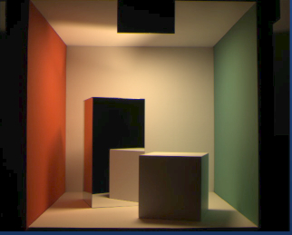
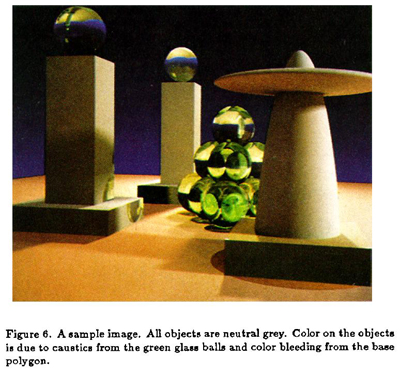
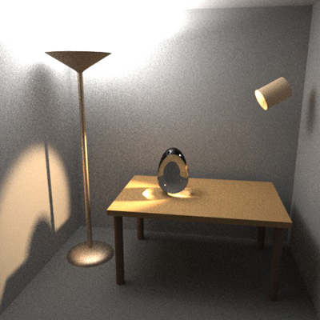
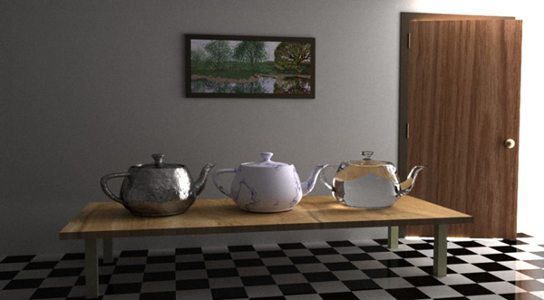
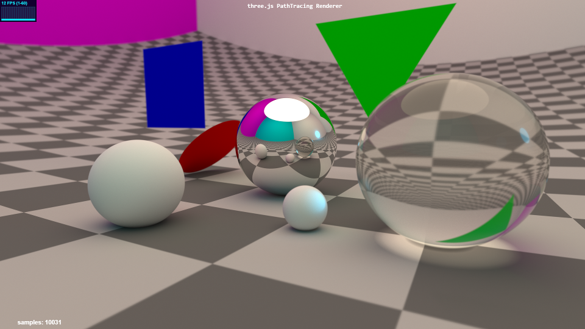

# THREE.js-PathTracing-Renderer
Real-time PathTracing with global illumination and progressive rendering, all on top of the Three.js WebGL framework.

<h2>LIVE DEMOS</h2>

* [Geometry Showcase Demo](https://erichlof.github.io/THREE.js-PathTracing-Renderer/Geometry_Showcase.html) demonstrating some primitive shapes for ray tracing.

* [Billiard Table Demo](https://erichlof.github.io/THREE.js-PathTracing-Renderer/Billiard_Table.html) shows support for image textures (i.e. .jpg .png) being loaded and used for materials (the billiard table cloth and two types of wood texture images are demonstrated).

* [Cornell Box Demo](https://erichlof.github.io/THREE.js-PathTracing-Renderer/CornellBox_DirectLighting.html) which renders the famous Cornell Box, but at ~60 fps!

For comparison, here is a real photograph of the original Cornell Box vs. a rendering with the three.js PathTracer:

 

 

* <h4>Classic Scenes</h4>
In 1986 James T. Kajiya published his famous paper The Rendering Equation, in which he presented an elegant unifying integral equation that generalizes a variety of previously known rendering algorithms.  Since the equation is infinitely recursive and hopelessly multidimensional, he suggests using Monte Carlo integration (sampling and averaging) to converge on a solution.  Thus Monte Carlo path tracing was born, which this repo follows fairly closely.  At the end of his paper he included an image that demonstrates global illumination through path tracing:

And here is the same scene from 1986, rendered in real-time at 60 fps:  
* [The Rendering Equation Demo](https://erichlof.github.io/THREE.js-PathTracing-Renderer/Classic_Scene_Kajiya_TheRenderingEquation.html)  
 

* <h4>Bi-Directional Path Tracing</h4> Nearly 20 years ago (Dec 1997), Eric Veach wrote a seminal PhD thesis paper on methods for light transport http://graphics.stanford.edu/papers/veach_thesis/  In Chapter 10, entitled Bi-Directional Path Tracing, Veach outlines a novel way to deal with difficult path tracing scenarios with hidden light sources (i.e. cove lighting, recessed lighting, spotlights, window lighting on a cloudy day, etc.).  Instead of just shooting rays from the camera like we normally do, we also shoot rays from the light sources, and then join the camera paths to the light paths.  Although his full method is difficult to implement on GPUs because of memory storage requirements, I took the basic idea and applied it to real-time path tracing of his classic test scene with hidden light sources.  For reference, here is a rendering made by Veach for his 1997 paper:

And here is the same room rendered in real-time by the three.js path tracer:  
* [Bi-Directional PathTracing Demo](https://erichlof.github.io/THREE.js-PathTracing-Renderer/Bi-Directional_PathTracing_ClassicTestScene.html)  

The following classic scene rendering comes from later in the same paper by Veach.  This scene is intentionally difficult to converge because there is no direct light, only indirect light hitting the walls and ceiling from a crack in the doorway.  Further complicating things is the fact that caustics must be captured by the glass object on the coffee table, without being able to directly connect with the light source.

And here is that scene rendered in real-time by the three.js path tracer: Try pressing 'E' and 'R' to open and close the door!  
* [Difficult Lighting Classic Test Scene Demo](https://erichlof.github.io/THREE.js-PathTracing-Renderer/Bi-Directional_DifficultLighting_ClassicTestScene.html)  

I had the above images only to go on - there are no scene dimensions specifications that I am aware of.  Since I don't have a working BVH acceleration structure just yet, I had to simplify the sculptures on the coffee table from Utah teapots to ellipsoids.  However, I feel that I have captured the essence and purpose of his test scene rooms.  I think Veach would be interested to know that his scenes, which probably took several minutes if not hours to render back in the 1990's, are now rendering real-time near 60 FPS on a web browser! :-D

For more intuition and a direct comparison between regular path tracing and bi-directional path tracing, here is the old Cornell Box scene but this time there is a blocker panel that blocks most of the light source in the ceiling.  The naive approach is just to hope that the camera rays will be lucky enough to find a light source:
* [Naive Approach to Blocked Light Source](https://erichlof.github.io/THREE.js-PathTracing-Renderer/Compare_Uni-Directional.html) As we can painfully see, we will have to wait a long time to get a decent image!
Enter Bi-Directional path tracing to the rescue!:
* [Bi-Directional Approach to Blocked Light Source](https://erichlof.github.io/THREE.js-PathTracing-Renderer/Compare_Bi-Directional_PathTracing.html) Like magic, the difficult scene comes into focus - in real-time!

* [Ocean and Sky Demo](https://erichlof.github.io/THREE.js-PathTracing-Renderer/Ocean_and_Sky_Rendering.html) which models an enormous calm ocean underneath a realistic physical sky. Now has more photo-realistic procedural clouds!

* [Water Rendering Demo](https://erichlof.github.io/THREE.js-PathTracing-Renderer/Water_Rendering.html) Renders photo-realistic water and simulates waves at 60 FPS. No triangle meshes are needed, as opposed to other traditional engines/renderers. In fact, not a single triangle was harmed during the making of this water volume! It is done through object/ray warping. Total cost: 1 ray-box intersection test!

* [Quadric Geometry Demo](https://erichlof.github.io/THREE.js-PathTracing-Renderer/Quadric_Geometry_Showcase.html) showing different quadric (mathematical) shapes (Warning: this may take 7-10 seconds to load/compile!)

<h3>Constructive Solid Geometry(CSG) Museum Demos</h3>

The following demos showcase different techniques in Constructive Solid Geometry - taking one 3D shape and either adding, removing, or overlapping a second shape. (Warning: these demos may take 10 seconds to load/compile!)  
All 4 demos feature a large dark glass sculpture in the center of the room, which shows Ellipsoid vs. Sphere CSG.  
Along the back wall, a study in Box vs. Sphere CSG: [CSG_Museum Demo #1](https://erichlof.github.io/THREE.js-PathTracing-Renderer/CSG_Museum_1.html)  
Along the right wall, a glass-encased monolith, and a study in Sphere vs. Cylinder CSG: [CSG_Museum Demo #2](https://erichlof.github.io/THREE.js-PathTracing-Renderer/CSG_Museum_2.html)  
Along the wall behind the camera, a study in Ellipsoid vs. Sphere CSG: [CSG_Museum Demo #3](https://erichlof.github.io/THREE.js-PathTracing-Renderer/CSG_Museum_3.html)  
Along the left wall, a study in Box vs. Cone CSG: [CSG_Museum Demo #4](https://erichlof.github.io/THREE.js-PathTracing-Renderer/CSG_Museum_4.html)  

Important note! - There is a hidden Easter Egg in one of the 4 Museum demo rooms.  Happy hunting!

<h3>Materials Demos</h3>

These demos showcase different materials possibilities:  
[Materials Demo #1](https://erichlof.github.io/THREE.js-PathTracing-Renderer/Materials_Showcase_1.html) Refractive (glass/water) and ClearCoat (billiard ball/car paint) materials  
[Materials Demo #2](https://erichlof.github.io/THREE.js-PathTracing-Renderer/Materials_Showcase_2.html) Cheap Volumetric (smoke/fog/gas) and Specular (aluminum mirror) materials  
[Materials Demo #3](https://erichlof.github.io/THREE.js-PathTracing-Renderer/Materials_Showcase_3.html) Diffuse (matte wall paint/chalk) and Translucent (skin/balloons,etc.) materials  
[Materials Demo #4](https://erichlof.github.io/THREE.js-PathTracing-Renderer/Materials_Showcase_4.html) Metallic (Gold) and shiny SubSurface scattering (polished Jade/wax candles) materials  

 
<h2>FEATURES</h2>

* Real-time interactive Path Tracing in your Chrome browser - even on your smartphone! ( What?! )
* First-Person camera navigation through the 3D scene.
* When camera is still, switches to progressive rendering mode and converges on a photo-realistic result!
* The accumulated render image will converge at around 1,000-2,000 samples (lower for simple scenes, higher for complex scenes).
* Direct lighting now makes images render/converge almost instantly!
* Both Uni-Directional (normal) and Bi-Directional path tracing approaches available for different lighting situations.
* Support for: Spheres, Planes, Discs, Quads, Triangles, and quadrics such as Cylinders, Cones, Ellipsoids, Paraboloids, Hyperboloids, Capsules, and Rings/Torii.
* Constructive Solid Geometry(CSG) allows you to combine 2 shapes using operations like addition, subtraction, and overlap.
* Basic support for loading models in .obj format (triangle and quad faces are supported, but no higher-order polys like pentagon, hexagon, etc.)
* Current material options: Metallic (mirrors, gold, etc.), Refractive (glass, water, etc.), Diffuse(matte, chalk, etc), ClearCoat(cars, plastic, billiard balls, etc.), Translucent (skin, leaves, cloth, etc.), Subsurface w/ shiny coat (jelly beans, cherries, teeth, polished Jade, etc.), Volumetric (smoke, dust, fog, etc.)
* Materials can now use Texture images which can be loaded, applied, and manipulated in the path tracer       
* Diffuse/Matte objects use Monte Carlo integration (a random process, hence the visual noise) to sample the unit-hemisphere oriented around the normal of the ray-object hitpoint and collects any light that is being received.  This is the key-difference between path tracing and simple old-fashioned ray tracing.  This is what produces realistic global illumination effects such as color bleeding/sharing between diffuse objects and refractive caustics from specular/glass/water objects.
* Camera has Depth of Field with real-time adjustable Focal Distance and Aperture Size settings for a still-photography or cinematic look.
* SuperSampling gives beautiful, clean Anti-Aliasing (no jagged edges!)
* Users will be able to use easy, familiar commands from the Three.js library, but under-the-hood the Three.js Renderer will use this path tracing engine to render the final output to the screen.

<h3>Experimental Works in Progress (W.I.P.)</h3>

The following demos show what I have been experimenting with most recently.  They might not work 100% and might have small visual artifacts that I am trying to fix.  I just wanted to share some more possible areas in the world of path tracing! :-)  

Rendering spheres, boxes and mathematical shapes is nice, but most modern graphics models are built out of triangles.  The following demo uses an .obj loader to load a model in .obj format (list of triangles) from disk and then places it in a scene to be path traced.  As of now, it runs too slow for my taste.  It still needs a BVH acceleration structure to speed things up greatly (I am currently investigating different approaches on the GPU). I am showing this because I wanted to demonstrate the ability of the three.js PathTracing renderer to load and render a model in one of the most popular model formats ever:  

* [.OBJ Model Loading Demo](https://erichlof.github.io/THREE.js-PathTracing-Renderer/OBJ_Model_Loader.html) 

I now have a working BVH (Bounding Volume Hierarchy) builder.  It builds a nested set of bounding boxes to avoid having to test every single triangle in the scene. Scenes which used to render at 10 FPS are now rendering at 50-60 FPS! For BVH test purposes, I randomize the branch that the ray takes when it is traversing the array of Bounding Boxes.  Hence the following demo, which renders the triangle model (a vintage desktop DOS PC - ha ha) as more of a 'point cloud' than a solid object. This is because the rays are taking random branches since in WebGL 1.0, I can't keep a stack with dynamic indexing like Boxes[x].data where x is the correct branch. But at least the model is loading and rendering very quickly. I just have to figure out how to access the arrays of boxes somehow so that the ray always takes the correct branch, and backs up and takes the other fork if it fails.  In the meantime, enjoy the famous Utah Teapot which has nearly 1000 triangles! :D  

* [BVH Debugging Demo](https://erichlof.github.io/THREE.js-PathTracing-Renderer/WIP_BVH_Debugging.html) 

This Demo renders objects inside a volume of gas/dust/fog/clouds(etc.).  Notice the cool volumetric caustics from the glass sphere on the left!:  

* [Volumetric Rendering Demo](https://erichlof.github.io/THREE.js-PathTracing-Renderer/Volumetric_Rendering.html)  

Some pretty interesting shapes can be obtained by deforming objects and/or warping the ray space (position and direction).  This demo applies a twist warp to the spheres and mirror box and randomizes the object space of the top purple sphere, creating an acceptable representation of a cloud (for free - no extra processing time for volumetrics!)
* [Ray/Object Warping Demo](https://erichlof.github.io/THREE.js-PathTracing-Renderer/Ray_Warping.html) 

<h2>Updates</h2>

* November 27th, 2017: I recently added 2 classic scenes demos - a Difficult Lighting scene from Eric Veach's thesis, and The Rendering Equation scene from Kajiya's famous 1986 paper.  These classic scenes are a good fit for the three.js path tracer because they have relatively few objects and simple shapes, which we can render real time without a dedicated geometry acceleration structure (like a BVH, that is still a WIP).  Even though they are simple in their composition, they usually contain a special light transport problem that must be solved quickly and correctly.  With modern GPUs, we can now render in 16 milliseconds what used to take minutes, if not hours, back in the late 80's and early 90's.  I personally had a lot of fun recreating these scenes just from one old image - it gives me a sense of connection with our CG heroes of the past!  :)
* October 26th, 2017: Texture images for materials are now supported!  Images stored on the server can be quickly loaded, applied to materials, and even manipulated in real time inside the path tracing loop. To see how to use texture images, check out the Billiard Table demo above, then have a look at the source code to see how to setup, load, and apply the textures.  It's a little hacky right now because I'm still figuring out the best way to integrate the concept of a three.js 'material' and my path tracing 'material'.  It's not a direct 1 to 1 correspondence because although both materials have concepts of their own color and image texture properties, mine have to contain reflectance data, roughness, IoR, etc., so that path tracing rays can bounce off of the materials correctly.  Also, in the near future I want to add support for normal maps (images that change/enhance the surface normals data) so that bumpy, rough, or scratchy surfaces will pop out in 3D more.  On the side, I'm still working on terrain (mountains) rendering from a heightmap texture image.  Going pretty well, but I need more FPS. GPU thread divergence among different rays (mountain rays on the lower half of the screen vs. sky rays on the upper half) is eating into the frame rate.  But visually it looks great - it's like you are transported to the Himalayas!
* October 3rd, 2017: Major strides have been made in the Bi-Directional path tracing area.  Difficult scenes (due to hidden light sources) which used to take minutes if not hours to come into focus, are now running at 60 FPS and converging under a minute, sometimes within seconds! Check out the new Bi-Directional scene demos above. In Eric Veach's (co-inventor of the Bi-Directional method) original algorithm, he kept a stack of camera path data as well as light path data, then chose different combinations of those 2 paths, depending on the effeciency they had on desired visual effects of the particular scene at hand.  This is not well-suited for GPUs because of the memory stack requirements, so I simplified the full algorithm down to what I'm calling Quasi Bi-Directional path tracing.  Instead of keeping a stack of all the possible paths, I simply join the random camera path to the random light path at the end of the ray tracing loop.  It runs so fast that all the desired effects eventually come into focus, which makes it possible for real-time games in the future where the game character might be in a dimly lit room.  I might put my simplified real-time algorithm to the ultimate test and try to render this scene: https://erichlof.github.io/THREE.js-PathTracing-Renderer/readme-Images/Ref.png Eric Veach had to resort to his novel Metropolis Light Transport (MLT) to deal with this super-difficult lighting situation. Just for fun, I may want to see how my lowly quasi bi-directional method stacks up! ;-) 
* September 9th, 2017: I've had my head in the clouds all summer long - literally! :-D I finally got the hang of using rgb noise textures to build and path trace procedural clouds.  Check out the new clouds inside the OceanAndSky rendering demo.  Now it's starting to look convincing!  I am currently working on making procedural landscapes with this new technique I learned (after 3 months of trial and errors, more of the latter ha ha).  Once I get procedural landscapes going smoothly, I will turn my attention to using jpg and png textures and applying them to object materials to be rendered.  I've received a couple of recent requests for this feature.  Stay tuned!
* April 21st, 2017: Major rendering engine update across all demos - more FPS and more photo-realism!  Also I have a working BVH builder for triangle models!  Check out the 'BVH debugging' demo above. The BVH data structure has sped up triangle models greatly - I'm getting around 60 fps for low poly models under 1000 triangles! However, rendering them is another story: I've hit a wall with the current WebGL 1.0 shader language (GLSL):  It doesn't allow accessing an array with a variable, like you can easily do in other languages.  For example, vec3 myBoxesData[64];  int x = 13;  float correctNode = myBoxesData[x].  The statement with myBoxesData[x] fails under the current implementation of WebGL 1.0 (It must be a constant like '2' or something).  Hopefully this won't be an issue when Three.js moves over to WebGL 2.0, which does support dynamic indexing of arrays. But in the meantime, I'm trying to figure out a workaround. Also I've been experimenting on the side with rendering fluids like water, oil, milk, etc.  I'll post something as soon as I get it working! :)
* March 3rd, 2017: Complete overhaul of mobile joystick controls.  Now the controls on Cell Phones and Tablets have a smooth, fluid response.  Also I changed the look of the buttons to directional, which makes more sense in this fly-cam setting.  However, I left the vintage joystick arcade-style circular buttons code intact, but commented out, so if you want a character jump-action button, etc., you can just mix and match the button shapes to your liking! :-)  

<h2>TODO</h2>

* Add support for layered texture materials (diffuse, normal map, specular map, emissive map, etc.)
* Instead of scene description hard-coded in the path tracing shader, let the scene be defined using the Three.js library
* Debug BVH branching - figure out a way around dynamic array index ban in WebGL 1.0, or wait until 2.0 support in three.js
* Dynamic Scene description/BVH updating and streaming into the GPU path tracer via Data Texture.  

<h2>ABOUT</h2>

* This began as a port of Kevin Beason's brilliant 'smallPT' ("small PathTracer") over to the Three.js WebGL framework.  http://www.kevinbeason.com/smallpt/  Kevin's original 'smallPT' only supports spheres of various sizes and is meant to render offline, saving the image to a PPM text file (not real-time). I have so far added features such as real-time progressive rendering on any device with a Chrome browser, FirstPerson Camera controls with Depth of Field, more Ray-Primitive object intersection support (such as planes, triangles, and quadrics), and support for more materials like ClearCoat and SubSurface.  

This project is in the alpha stage.  More examples, features, and content to come...
