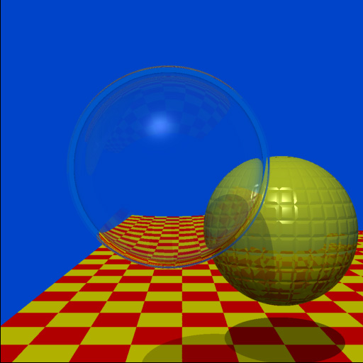

# THREE.js-PathTracing-Renderer
Real-time PathTracing with global illumination and progressive rendering, all on top of the Three.js WebGL framework.

<h2>LIVE DEMOS</h2>

* [Geometry Showcase Demo](https://erichlof.github.io/THREE.js-PathTracing-Renderer/Geometry_Showcase.html) demonstrating some primitive shapes for ray tracing.  

* [Animated BVH Model Demo](https://erichlof.github.io/THREE.js-PathTracing-Renderer/BVH_Animated_Model.html) not only loads and renders a 15,000+ triangle GLTF model with correct PBR materials (albedo, emmisive, metallicRoughness, and normal maps), but it also translates and rotates the entire model and its BVH structure in real time at 60 fps!  Loading animations for rigged models is W.I.P. still under investigation, but getting the models to move, rotate, and scale arbitrarily was a huge step forward for the pathtracing game engine! *Note: BVH demos are for desktop only, mobile is W.I.P.*

* [Ocean and Sky Demo](https://erichlof.github.io/THREE.js-PathTracing-Renderer/Ocean_And_Sky_Rendering.html) which models an enormous calm ocean underneath a realistic physical sky. Now has more photo-realistic procedural clouds!

* [Billiard Table Demo](https://erichlof.github.io/THREE.js-PathTracing-Renderer/Billiard_Table.html) shows support for image textures (i.e. .jpg .png) being loaded and used for materials (the billiard table cloth and two types of wood texture images are demonstrated).

* [Cornell Box Demo](https://erichlof.github.io/THREE.js-PathTracing-Renderer/Cornell_Box.html) This demo renders the famous Cornell Box in real-time!

For comparison, here is a real photograph of the original Cornell Box vs. a rendering with the three.js PathTracer:

 

 

* [Volumetric Rendering Demo](https://erichlof.github.io/THREE.js-PathTracing-Renderer/Volumetric_Rendering.html) renders objects inside a volume of dust/fog/etc..  Notice the cool volumetric caustics from the glass sphere on the left, rendered almost instantly!

* [Terrain Demo](https://erichlof.github.io/THREE.js-PathTracing-Renderer/Terrain_Rendering.html) combines traditional raytracing with raymarching to render stunning outdoor environments in real time!  Land is procedurally generated, can be altered with simple parameters. Total number of triangles processed for these worlds: 2! (for screen size quad) :-)

* [Planet Demo (W.I.P.)](https://erichlof.github.io/THREE.js-PathTracing-Renderer/Planet_Rendering.html) takes raymarching and raytracing to the extreme and renders an entire Earth-like planet with physically-based atmosphere!  Still a work in progress, the terrain is procedurely generated.  Although the mountains/lakes are too repetitious (W.I.P.), this simulation demonstrates the power of path tracing: you can hover above the planet at high orbit (5000 Km altitude), then drop all the way down and land your camera right on top of a single rock or single lake water wave (1 meter). All planet/atmosphere measurements are to scale.  The level of detail possible with raytracing is extraordinary! *Note: demo is for desktop only - mobile lacks the precision to explore the terrain correctly and has rendering artifacts. Mobile is a W.I.P.*

* [Water Rendering Demo](https://erichlof.github.io/THREE.js-PathTracing-Renderer/Water_Rendering.html) Renders photo-realistic water and simulates waves at 60 FPS. No triangle meshes are needed, as opposed to other traditional engines/renderers. The water surface is achieved through ray marching.

* [Quadric Geometry Demo](https://erichlof.github.io/THREE.js-PathTracing-Renderer/Quadric_Geometry_Showcase.html) showing different quadric (mathematical) shapes.

* [BVH Point Light Source Demo](https://erichlof.github.io/THREE.js-PathTracing-Renderer/BVH_Point_Light_Source.html) Demonstrates use of a point light to illuminate the famous Stanford Bunny (30,000+ triangles!).  Normally a dark scene like this with a very bright small light would be super-noisy, but thanks to randomized direct light targeting, the image converges almost instantly! *Note: this and the following BVH and glTF demos are for desktop only, mobile is W.I.P.*

* [BVH Spot Light Source Demo](https://erichlof.github.io/THREE.js-PathTracing-Renderer/BVH_Spot_Light_Source.html) A similar scene but this time a bright spotlight in the air is aimed at the Stanford Bunny, making him the star of the scene!  The spotlight is made out of dark metal on the outside and a reflective metal on the inside.  Notice the light falloff on the checkered floor.

* [HDRI Environment Demo](https://erichlof.github.io/THREE.js-PathTracing-Renderer/HDRI_Environment.html) shows how to load an equi-rectangular HDRI map to use as the scene's surrounding environment.  This demo also uses the optimized BVH accelerator to load the famous Stanford Dragon model consisting of 100,000 triangles and renders the scene in real-time!  I also added a material and color picker so you can instantly change the dragon's material type (glass, metal, ceramic) and its material color without missing a beat! *Note: please allow 5-10 seconds to download the large HDR image*

* [BVH Visualizer Demo](https://erichlof.github.io/THREE.js-PathTracing-Renderer/BVH_Visualizer.html) Lets you peek under the hood of the BVH acceleration structure and see how the various axis-aligned bounding boxes are built all the way from the large surrounding root node box (level 0), to the small leaf node boxes (level 14+), to the individual triangles of the model that are contained within those leaf node boxes.  This demo loads the famous Stanford Dragon (100,000 triangles!) and renders it as a purple light source inside yellow glass bounding boxes of its BVH 

* [GLTF Viewer Demo](https://erichlof.github.io/THREE.js-PathTracing-Renderer/Gltf_Viewer.html) This cool viewer not only loads models in glTF format, but also uses three.js' RGBE.Loader to load an equi-rectangular HDR image as the background and for global lighting. Many thanks to github user [n2k3](https://github.com/n2k3) for his awesome contributions to this viewer!  He implemented a slick loading animation as well as a GUI panel that allows you to change the sun angle, sun intensity, sun color, hdr intensity, and hdr exposure.  More features to come! 

<h3>Constructive Solid Geometry(CSG) Museum Demos</h3>

The following demos showcase different techniques in Constructive Solid Geometry - taking one 3D shape and either adding, removing, or overlapping a second shape. *Note: these demos may take several seconds to compile*  
All 4 demos feature a large dark glass sculpture in the center of the room, which shows Ellipsoid vs. Sphere CSG.  
Along the back wall, a study in Box vs. Sphere CSG: [CSG_Museum Demo #1](https://erichlof.github.io/THREE.js-PathTracing-Renderer/CSG_Museum_1.html)  
Along the right wall, a glass-encased monolith, and a study in Sphere vs. Cylinder CSG: [CSG_Museum Demo #2](https://erichlof.github.io/THREE.js-PathTracing-Renderer/CSG_Museum_2.html)  
Along the wall behind the camera, a study in Ellipsoid vs. Sphere CSG: [CSG_Museum Demo #3](https://erichlof.github.io/THREE.js-PathTracing-Renderer/CSG_Museum_3.html)  
Along the left wall, a study in Box vs. Cone CSG: [CSG_Museum Demo #4](https://erichlof.github.io/THREE.js-PathTracing-Renderer/CSG_Museum_4.html)  

Important note! - There is a hidden Easter Egg in one of the 4 Museum demo rooms.  Happy hunting!

<h3>Materials Demos</h3>

* [Switching Materials Demo](https://erichlof.github.io/THREE.js-PathTracing-Renderer/Switching_Materials.html)
This demo showcases different materials possibilities. The materials that are feautured are: Diffuse (matte wall paint/chalk), Refractive (glass/water), Specular (aluminum/gold), ClearCoat (billiard ball, plastic, porcelain), Car clearCoat (colored metal with clear coat), Translucent (skin/balloons, etc.), and shiny SubSurface scattering (polished Jade/wax/marble, etc.)  

* [Material Roughness Demo](https://erichlof.github.io/THREE.js-PathTracing-Renderer/Material_Roughness.html)
Demonstrates increasing levels of roughness on different materials.  From left to right, roughness on the left sphere is set at 0.0, then 0.1, 0.2, 0.3 etc., all the way to the max: 1.0 roughness on the right sphere. The demo starts out with a clearcoat cyan plastic-like material, but you can choose different material presets from the selection menu, as well as change the material color in realtime.  I have researched and perfected the importance sampling of different specular roughness lobes, which results in very fast convergence, especially smoother to medium-rough materials.  Try all the presets for yourself!  
 

<h3> Real-Time Transformation of Primitive Geometry</h3>

* [Transforming Quadric Geometry Demo](https://erichlof.github.io/THREE.js-PathTracing-Renderer/Transforming_Quadric_Geometry_Showcase.html) Using the game engine version of the three.js path tracer, this demo shows how to create multiple objects (a bunch of 'THREE.Object3d()'s, each with its own transform) on the JavaScript side when initializing three.js, and then send the objects over to the GPU for realtime pathtracing.  The nice thing about having my pathtracer sitting on top of three.js is that I can use its built-in transformations such as Translate, Rotate, and Scale.  Since these shapes are mathematical (all quadrics), I also included clipping parameters so you can have partial shapes and can even animate the cutting process! *Note: this demo may take several seconds to compile*    

* <h3>Classic Scenes</h3>

While working at Bell Labs and writing his now-famous paper [An Improved Illumination Model for Shaded Display](http://artis.imag.fr/Members/David.Roger/whitted.pdf), J. Turner Whitted created an iconic ray traced scene which showcased his novel methods for producing more realistic images with a computer. Beginning work in 1978, he rendered a handful of scenes featuring spheres and planes with various materials and reflectivity, so that these images would be included in his paper (which would be published in June 1980).  Then, for an upcoming SIGGRAPH conference submission, Whitted decided to create an animated sequence of individual rendered images.  Thus the first ever ray traced animation was born!  This style of putting together single frames of pre-rendered images would continue through a lineage of movies such as Tron, Toy Story, Cars, all the way to current animated feature films.     

[Vintage 1979 Video: 'The Compleat Angler' by J. Turner Whitted](https://youtu.be/0KrCh5qD9Ho)

Although this movie appears as a smooth animation, it took around 45 minutes to render each individual frame back in 1979!  Fast forward to today and using WebGL 2.0 and the parallel processing power of GPUs, here is the same iconic scene rendered at 60 times a second in your browser! :  
* [The Compleat Angler demo](https://erichlof.github.io/THREE.js-PathTracing-Renderer/Classic_Scene_Whitted_TheCompleatAngler.html)  

Thank you Dr. Whitted for your pioneering computer graphics work and for helping start the rendered animation industry!    
 

In 1986 James T. Kajiya published his famous paper [The Rendering Equation](http://citeseerx.ist.psu.edu/viewdoc/summary?doi=10.1.1.63.1402), in which he presented an elegant unifying integral equation that generalizes a variety of previously known rendering algorithms.  Since the equation is infinitely recursive and hopelessly multidimensional, he suggests using Monte Carlo integration (sampling and averaging) to converge on a solution.  Thus Monte Carlo path tracing was born, which this repo follows fairly closely.  At the end of his paper he included an image that demonstrates global illumination through path tracing:

And here is the same scene from 1986, rendered in real-time at 60 fps:  
* [The Rendering Equation Demo](https://erichlof.github.io/THREE.js-PathTracing-Renderer/Classic_Scene_Kajiya_TheRenderingEquation.html)  
 

* <h4>Bi-Directional Path Tracing</h4> In December of 1997, Eric Veach wrote a seminal PhD thesis paper on methods for light transport http://graphics.stanford.edu/papers/veach_thesis/  In Chapter 10, entitled Bi-Directional Path Tracing, Veach outlines a novel way to deal with difficult path tracing scenarios with hidden light sources (i.e. cove lighting, recessed lighting, spotlights, window lighting on a cloudy day, etc.).  Instead of just shooting rays from the camera like we normally do, we also shoot rays from the light sources, and then join the camera paths to the light paths.  Although his full method is difficult to implement on GPUs because of memory storage requirements, I took the basic idea and applied it to real-time path tracing of his classic test scene with hidden light sources.  For reference, here is a rendering made by Veach for his 1997 paper:

And here is the same room rendered in real-time by the three.js path tracer:  
* [Bi-Directional PathTracing Demo](https://erichlof.github.io/THREE.js-PathTracing-Renderer/Bi-Directional_PathTracing.html)  

The following classic scene rendering comes from later in the same paper by Veach.  This scene is intentionally difficult to converge because there is no direct light, only indirect light hitting the walls and ceiling from a crack in the doorway.  Further complicating things is the fact that caustics must be captured by the glass object on the coffee table, without being able to directly connect with the light source.

And here is that scene rendered in real-time by the three.js path tracer: Try pressing 'E' and 'R' to open and close the door!  
* [Difficult Lighting Classic Test Scene Demo](https://erichlof.github.io/THREE.js-PathTracing-Renderer/Bi-Directional_Difficult_Lighting.html) *Note: this demo may take several seconds to compile*  

I had the above images only to go on - there are no scene dimensions specifications that I am aware of.  However, I feel that I have captured the essence and purpose of his test scene rooms.  I think Veach would be interested to know that his scenes, which probably took several minutes if not hours to render back in the 1990's, are now rendering real-time (30-60 fps) on a web browser! :-D

For more intuition and a direct comparison between regular path tracing and bi-directional path tracing, here is the old Cornell Box scene but this time there is a blocker panel that blocks most of the light source in the ceiling.  The naive approach is just to hope that the camera rays will be lucky enough to find a light source:
* [Naive Approach to Blocked Light Source](https://erichlof.github.io/THREE.js-PathTracing-Renderer/Compare_Uni-Directional_Approach.html) As we can painfully see, we will have to wait a long time to get a decent image!
Enter Bi-Directional path tracing to the rescue!:
* [Bi-Directional Approach to Blocked Light Source](https://erichlof.github.io/THREE.js-PathTracing-Renderer/Compare_Bi-Directional_Approach.html) Like magic, the difficult scene comes into focus - in real-time!      

<h3>Game Engine path tracer for Desktop and Mobile</h3>

Before I got into this world of path tracing, I was a 3D game programmer (and still am, although path tracing is consuming most of my coding time!).  My first game was way back in 1998, using OpenGL 1 and the C language, back when these new things called graphics cards were all the rage! [my old Binary Brotherz page](https://web.archive.org/web/20010405004141/http://www.binarybrotherz.com/games.html)  Although using OpenGL back then, and WebGL today was/is cool, I always wanted more in terms of lighting, shadows, reflections, diffuse color sharing, etc., in my game engines that I just couldn't get from rasterizing graphics APIs.  Well, fast forward to 2019 and NVidia is releasing graphics cards dedicated to real-time ray tracing!  I couldn't have imagined this back in the 90's! However, at the time I'm writing this, NVidia is only doing specular ray tracing as a bonus feature on top of the old rasterization technique. I wanted to see if I could 'overclock' my full path tracer's convergence so that you could see the beautiful light effects in real time, being able to possibly move a game character or 1st-person camera through a Path traced game environment at 60 fps and 30-60 fps on mobile.  Recently, I have been experimenting with different amounts of diffuse color bleeding vs. direct light shadows and, if you're willing to sacrafice some ultimate physical reality (like perfect converged reflected/refracted caustics), then you can have this!:  

* [Future Game Engine PathTracer Demo](https://erichlof.github.io/THREE.js-PathTracing-Renderer/GameEngine_PathTracer.html) 
To my knowledge, this is just about as fast as I can push the path tracing engine and WebGL in general, and still retain good lighting, accurate reflections, and almost instant convergence of noise.  As computers get faster, this will be the future game rendering engine - a simple path tracer that is just around 500 to 1000 lines of code, which is easy to maintain and debug, and that gives photo-realistic real-time results! I already have some ideas for some simple 3d games that can use this technology.  I'll keep you posted!  
 
*Update: May 24th, 2019*
- As promised I wanted to post an exciting update to the game engine path tracer.  What better way to give proof of concept and put it through its paces than an actual game!  I am pleased to announce the first ever pathtraced game for desktop and mobile: AntiGravity Pool!  Since it uses a physics engine and various custom components, I decided to create a dedicated repository for just this new game. Be sure to check it out!  

* [AntiGravity Pool game](https://erichlof.github.io/AntiGravity-Pool/AntiGravityPool.html)
* [AntiGravity Pool project](https://github.com/erichlof/AntiGravity-Pool)

 
 
A random sample rendering from the three.js pathtracing renderer as it was in 2015!
 

<h2>FEATURES</h2>

* Real-time interactive Path Tracing in your browser - even on your smartphone! ( What?! )
* First-Person camera navigation through the 3D scene.
* When camera is still, switches to progressive rendering mode and converges on a photo-realistic result!
* The accumulated render image will converge at around 500-3,000 samples (lower for simple scenes, higher for complex scenes).
* Randomized Direct Light sampling now makes images render/converge almost instantly!
* Both Uni-Directional (normal) and Bi-Directional path tracing approaches available for different lighting situations.
* Support for: Spheres, Planes, Discs, Quads, Triangles, and quadrics such as Cylinders, Cones, Ellipsoids, Paraboloids, Hyperboloids, Capsules, and Rings/Torii. Parametric/procedural surfaces (i.e. terrain, clouds, waves, etc.) are handled through Raymarching.
* Constructive Solid Geometry(CSG) allows you to combine 2 shapes using operations like addition, subtraction, and overlap.
* Support for loading models in .gltf and .glb formats
* BVH (Bounding Volume Hierarchy) greatly speeds up rendering of triangle models in gltf/glb format (tested up to 500,000 triangles!)
* Current material options: Metallic (mirrors, gold, etc.), Refractive (glass, water, etc.), Diffuse(matte, chalk, etc), ClearCoat(cars, plastic, billiard balls, etc.), Translucent (skin, leaves, cloth, etc.), Subsurface w/ shiny coat (jelly beans, cherries, teeth, polished Jade, etc.)
* Support for PBR materials on models in gltf format (albedo diffuse, emissive, metallicRoughness, and normal maps)        
* Diffuse/Matte objects use Monte Carlo integration (a random process, hence the visual noise) to sample the unit-hemisphere oriented around the normal of the ray-object hitpoint and collects any light that is being received.  This is the key-difference between path tracing and simple old-fashioned ray tracing.  This is what produces realistic global illumination effects such as color bleeding/sharing between diffuse objects and refractive caustics from specular/glass/water objects.
* Camera has Depth of Field with real-time adjustable Focal Distance and Aperture Size settings for a still-photography or cinematic look.
* SuperSampling gives beautiful, clean Anti-Aliasing (no jagged edges!)
* Users will be able to use easy, familiar commands from the Three.js library, but under-the-hood the Three.js Renderer will use this path tracing engine to render the final output to the screen.

<h3>Experimental Works in Progress (W.I.P.)</h3>

The following demos show what I have been experimenting with most recently.  They might not work 100% and might have small visual artifacts that I am trying to fix.  I just wanted to share some more possible areas in the world of path tracing! :-)  

Some pretty interesting shapes can be obtained by deforming objects and/or warping the ray space (position and direction).  This demo applies a twist warp to the spheres and mirror box and randomizes the object space of the top purple sphere, creating an acceptable representation of a cloud (for free - no extra processing time for volumetrics!)  

* [Ray/Object Warping Demo](https://erichlof.github.io/THREE.js-PathTracing-Renderer/Ray_Warping.html) 

I had the code to the following demo lying around in my code editor for months.  It's a work in progress (W.I.P.) real-time rendering of an Arctic Circle environment.  I was experimenting with my ray marching engine and what types of environments I could get out of it by just altering some parameters.  I'm still trying to figure out how to render the blueish color deep inside polar ice, but I've been working on other things for this repo like the BVH demos instead. So far it's pretty cool though - when the scene first opens, it's almost like you're transported to the far north! As path tracing gets faster in the future, this is how we will travel!  ;-)  

* [Arctic Circle Demo](https://erichlof.github.io/THREE.js-PathTracing-Renderer/Arctic_Circle.html) 

<h2>Updates</h2>

* October 26th, 2019: New Material Roughness demo!  For the past month I have been researching how to efficiently handle different levels of roughness on specular materials.  I wanted to be able to render any material with any roughness, similar to Disney, Unity and Unreal Engine's PBR technical documents where they line up 9 or 10 spheres with increasing amounts of roughness from left to right.  Now not only does the three.js pathtracing renderer handle these various material parameters in a realistic manner, it does so at 60 FPS!  This is all thanks to the clever specular Importance Sampling of the 'cone' of directions that gets wider and wider as the roughness increases.  You'll notice that the smoother spheres on left and towards the middle converge almost instantly, but the rightmost spheres take a couple of seconds.  So if you really need something that rough, it might be better just to use a diffuse surface that samples the light sources as well. There *is* the possibility of MIS (Multiple Importance Sampling from the legendary Eric Veach) which cleverly decides to sample the cone, or the light source, or both and later mix the two.  But I have yet to fully understand the math and algorithm behind this technique.  For now the classic single Importance Sampling of the material is a big improvement in materials rendering for the path tracer!   

* September 19th, 2019: Faster (almost instantaneous!) convergence on demos featuring spherical light sources.  I used to sample sphere lights by picking a random point on the sphere and sending the diffuse surface ray towards that point to get a direct lighting sample.  Although this technique works, it results in a little more noise due to the fact that the random points might be on the back of the sphere in relation to how the diffuse surface is facing the sphere light. Statistically speaking, this doesn't quite give as smooth of a coverage as I was hoping for.  So I changed the sampleSphereLight routine (which can be found in the pathTracingCommon.js file inside the 'js' folder) to now instead sample the directions of the imaginary cone pointing toward the sphere light. The apex or point of the cone starts at the diffuse surface point that needs to be lit and shaded, and then this cone 'opens up' to perfectly engulf the spherical light source.  Once this cone is calculated, random vector directions are picked only inside this cone, giving more uniform coverage of the light source, as seen from the diffuse surface's point of view. The result is smoother shading on scenes with spherical light sources. Some of these demos include: GeometryShowcase, QuadricGeometryShowcase, BVH_PointLightSource, BVH_SpotlightSource, GameEnginePathTracer, TransformingQuadricGeometryShowcase, and VolumetricRendering demos.  See for yourself! :)  

* July 16th, 2019: The game path tracing engine is up and running, with a proof-of-concept simple 3D game to show its capabilities!  Be sure to check out my new game project at https://github.com/erichlof/AntiGravity-Pool and experience a fully pathtraced game running at 60fps on desktop and 30-60fps on mobile (runs at 60fps on my Samsung s9)!  Also, I updated and improved the algorithm for the Bi-Directional demo (the gray room with the Egg-shaped glass sculpture on the little wooden table).  I found a way to get the most out of the tight path tracing loop, and because of that improvement, it only needs 1 sample per-pixel to give a decent image with less noise, which in turn keeps the framerate near 60fps!  I might try to apply this new algo to the Difficult Lighting bi-directional demo, but it will be a harder task because the geometry/materials of the 3 Utah teapots on the coffee table adds to the complexity/rendering-time of the tight real-time path tracing loop.  As always, I'll keep you posted if I can get that demo running better also!     

* May 24th, 2019: Big speedup in real-time convergence across entire codebase!  In the past I had been using Kevin Beason's (see his 'smallpt' link at bottom of this page) clever trick when rendering transparent surfaces such as glass and water of randomly deciding which ray branch to take; reflect or transmit/refract based on the IoR of the surface in question.  Although this eventually produces the correct result with progressive rendering over time (according to Monte Carlo integration theory), it leads to animated noise on glass and water surfaces when they are presented in a dynamic scene where the camera is constantly moving and objects or ocean waves for example are constantly moving as well.  The noise was due to the path tracer continually randomly deciding which branch to go down, reflect or transmit.  Well, now I have removed all of those artifacts and the viewer is presented with a clean double image, one that is slightly reflected and another that was transmitted/refracted.  At the cost of a little more shader complexity (storing both branches) and a couple of more GPU cycles (doesn't affect most demos framerate, yay), we now have photo realistic transparent surfaces that behave physically correctly even when moving - the results are stunning!  On a whim, I applied the same storage of both branches technique to diffuse surfaces (that can either sample the light as a shadow ray, or pick up diffuse color bleed from nearby objects), and the speedup is breathtaking! Every single demo (except BiDirectional demos - still w.i.p. with those) is greatly enhanced - see for yourself! :)

* February 27th, 2019: New Classic Scene demo based on the short vintage CG film: The Compleat Angler(1979) by J. Turner Whitted.  For a while now I have been wanting to put together a demo paying homage to this pioneer of ray tracing.  In 1978, Dr. Whitted began work on his seminal paper, An Improved Illumination Model for Shaded Display, in which he introduced his novel technique of recursively tracing light rays to produce realistic images with optical effects such as reflection and refraction.  To supplement his paper, he rendered still images and for a SIGGRAPH conference, he put together a series of pre-rendered images making a short animation.  This is the very first ray traced movie!  I wanted to re-create this animation in real-time in the browser, but I only had the short looping vintage movie to go on.  Part of the challenge was getting the old-style materials (that didn't necessarily conserve light energy, but they looked cool) to behave correctly.  And the yellow sphere has a bumpy tiling texture on it (no idea how Whitted coded that in 1979), so I resorted to using a more modern invention - the normal map.  But even though I had to reverse-engineer the scene and add in a few of my own hacks, I believe I have re-created the scene faithfully.   

* December 28th, 2018: Global lighting algorithm changes across the entire codebase.  Lately I have been trying to implement different light types (point light, spot light, etc.) to the scenes containing a large triangle model with its BVH. Applying the same direct lighting algo to this scenario didn't quite work as well as I had hoped, due to the doubling of geometry searches each frame in order to make the direct lighting work.  The frame rate suffered and sometimes the browser WebGL rendering context would be lost all together.  While reading for enjoyment one day I happened to come upon a single sentence from Peter Shirley's relatively recent series entitled Ray Tracing in One Weekend (a great read) where he mentions that there are 2 camps: the first of which I and most path tracing coders out there belonged to is one where you sample the light directly on each diffuse bounce (direct lighting / or the shadow ray technique). The other camp in the minority (of which Peter Shirley is a member, and now me too) is one where you statistically just send the diffuse reflected rays more toward the light source (no matter how small it is), and down-weight the contributions according to probability theory.  I tried this 'new' approach on my old Cornell Box demo, replacing the heavy direct lighting with the new lightweight stochastic light sampling and it worked so well that I changed all the demos on this repo to use the second camp's approach!  It increased the frame rate (especially on mobile, not having to search the geometry twice on each diffuse bounce) and noise converging is as-fast or nearly-as-fast depending on the lighting complexity.  Often I can't visually tell which one is being used, which is a good thing!  But the important thing is that when I add small light sources to the BVH scenes in the near future, hopefully this new technique will scale much better and avoid the framerate hit and the browser crashing.  Stay tuned!

<h2>TODO</h2>

* For simple scenes without gltf models, instead of scene description hard-coded in the path tracing shader, let the scene be defined using familiar Three.js mesh creation commands
* Figure out how to save pathtraced results into texture maps to be used for lightmaps (optimized baked lighting for static geometry)
* Dynamic Scene description/BVH rigged model animation streamed real-time to the GPU path tracer 

<h2>ABOUT</h2>

* This began as a port of Kevin Beason's brilliant 'smallPT' ("small PathTracer") over to the Three.js WebGL framework.  http://www.kevinbeason.com/smallpt/  Kevin's original 'smallPT' only supports spheres of various sizes and is meant to render offline, saving the image to a PPM text file (not real-time). I have so far added features such as real-time progressive rendering on any device with a Chrome browser, FirstPerson Camera controls with Depth of Field, more Ray-Primitive object intersection support (such as planes, triangles, and quadrics), loading and rendering .gltf triangle models, and support for more materials like ClearCoat and SubSurface.  

This project is in the beta stage.  More examples, features, and content to come...
